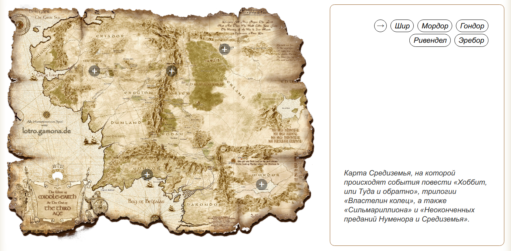

# Скрипт интерактивного изображения с метками | ArPic



#### Демо вы можете посмотреть здесь: [DEMO](https://art.osepyan.ru/arpic/)

### Документация:

Данный скрипт позволяет создавать адаптивные изображения с интерактивными метками.  
Скрипт по умолчанию поддерживает до 50 меток на изображении.

Для начала работы необходимо подключить файлы `artag.css` и `artag.js`.

### В HTML документе создаем блок с интерактивными метками на изображении:

```html
<div class="ar-inter-block" id="ar-inter">
    <div class="left">
        <div class="ar-img">
            <span></span> <!--метка на изображении-->
            <span></span>
        </div>
    </div>
    <div class="right">
        <div class="ar-btn-title">
            <button></button> <!--кнопка заголовок-->
            <button></button>
            <button></button>
        </div>
        <div class="ar-desc">
            <div></div> <!--текстовое описание-->
            <div></div>
            <div></div>
        </div>
    </div>
</div>
```

- В `id="ar-inter"` прописываем идентификатор блока с интерактивным изображением (например `ar-inter1`, `ar-inter2` ...).  
  Блоков с интерактивными изображениями может быть несколько на странице, поэтому не забывайте менять `id`.
- Тег `span` отвечает за конкретную метку на изображении (является необязательным), в них не надо ничего записывать.  
  Вы можете создать до 50 меток (тегов `span`).
- Блок `class="right"` является необязательным.  
  Вы можете создать только изображение с метками, без заголовков и текстового описания, либо создать изображение с описанием, но без меток. Ничего дополнительно настраивать не придется.
- Тег `button` отвечает за кнопку-заголовок (является необязательным). В тег `button` (начиная со второго по счету) необходимо записать текстовое содержимое.  
  Самый первый тег `button` является кнопкой возврата к исходному состоянию блока, его не надо редактировать.
- Тег `div` — это контейнер для подробного описания каждой метки и каждого заголовка (является необязательным).  
  В данном контейнере Вы можете разместить текст, ссылки, изображения и т.д.  
  Самый первый тег `div` будет отображаться по умолчанию в исходном состоянии блока.
- Не рекомендуется создавать или менять классы у элементов.  
  При необходимости подключайтесь к уже созданным классам через CSS и кастомизируйте под собственный проект.

### В CSS необходимо настроить изображение и позицию меток:

Вы можете записать следующие строки в своем файле CSS:

- Указываем путь до главного изображения.  
  Указывайте правильный ID (`#ar-inter`) для настраиваемого блока.

```css
#ar-inter .ar-img {
    background: url('путь до изображения');
}
```

- Указываем увеличение и положение изображения при активации первой метки.  
  При необходимости настраиваем положение для остальных меток (.ar-btn1, .ar-btn2, ..., .ar-btn49, .ar-btn50).

```css
#ar-inter .ar-img.ar-btn1 {
    background-size: 460% !important;
    background-position-x: 25% !important;
    background-position-y: 20% !important;
}
```

- Вы можете подставлять разные изображения на каждую метку.  
  Для этого необходимо указать путь до изображения и его позицию для нужной метки.  
  При необходимости настраиваем и для остальных меток (.ar-btn1, .ar-btn2, ..., .ar-btn49, .ar-btn50).

```css
#ar-inter .ar-img.ar-btn1 {
    background-image: url('путь до изображения');
    background-size: 100% !important;
    background-position-x: 0% !important;
    background-position-y: 0% !important;
}
```

- Указываем положение метки на изображении.  
  При необходимости настраиваем остальные метки (.ar-btn1, .ar-btn2, ..., .ar-btn49, .ar-btn50).

```css
#ar-inter .ar-img .ar-btn5 {
    left: 27%;
    bottom: 70%;
}
```

- Вы можете настроить всплывающую подсказку при наведении на метку.  
  При необходимости настройте содержимое `content` для каждой метки (.ar-btn1, .ar-btn2, ..., .ar-btn49, .ar-btn50).

```css
#ar-inter .ar-img .ar-btn1::before {
    content: 'Текст';
}
```

### В JS необходимо вызвать функцию `arInter()`:

- Вызов функции вы можете прописать в любом JS-файле, подключённом в HTML после `artag.js`.
- Вызывать функцию `arInter()` необходимо для каждого блока.
- Обязательные атрибуты функции `arInter()`: ID блока, ширина изображения, высота изображения.  
  Указываем ширину и высоту исходного изображения, чтобы корректно работала адаптивность.

```javascript
arInter('#ar-inter', 2560, 2005);
```